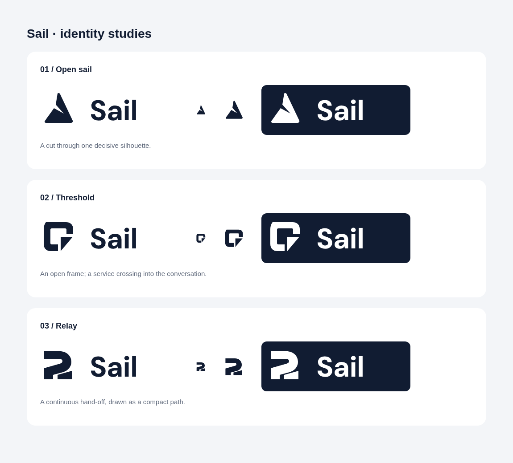

# Sail — graphic design review and identity concepts

Three independent design agents reviewed the actual current screenshots: a senior graphic designer, an editorial art director and a brand identity designer.

## What is working

The ordinary assistant recommendation versus branded booking widget explains the core distinction. Consistent phone chrome, compact catalogue cards and matching requests should remain.

## What needs work

| Priority | Finding | Concrete correction |
| --- | --- | --- |
| High | The seat map is not a credible aircraft plan. | Use numbered rows and A B C / aisle / D E F, with one selected 12A. |
| High | Upload success looks like a placeholder. | Show document thumbnail, filename, size and one received-for-review state. |
| High | Finale retains catalogue after confirmed order. | Show a compact receipt and give surrounding outcomes more breathing room. Applied in the revised preview below. |
| Medium | Diagram framing outweighs the phone. | Compress framing and clarify the action → branded UI → adapter → host handoff. |
| Medium | Product crop is too abstract; business brands share assistant blue. | Use a recognisable product image and distinct restrained merchant accents. |
| High | Two-strip Sail mark is generic. | Replace with a stronger single silhouette; compare three vector studies below. |

[Full screen-specific critique](GRAPHIC-DESIGN-CRITIQUE.md) · [Independent art-direction review](ART-DIRECTION-CRITIQUE.md)

## Logo recommendation: 01 / Open sail

One decisive sail silhouette with an asymmetric negative-space seam. All concepts have icon-only, outlined wordmark and reversed SVGs, tested at 24px and 48px. Native vector design; no generated imagery.

[Download recommended icon](logos/01-open-sail-icon.svg) · [Outlined lockup](logos/01-open-sail-lockup.svg) · [Reversed lockup](logos/01-open-sail-light.svg) · [All concepts](logos)

## Applied previews

[Diagram with recommended logo](flow-new-logo.png) · [Refined finale with order receipt and new logo](finale-new-logo.png)

The finale now has a smaller headline, reduced outer cards, clearer space around the phone and a completed receipt. Existing narration and timing are retained. Screenshot previews only; no new full reel was rendered. HyperFrames reports zero runtime, layout or contrast errors for the revised preview; one transitional contrast warning remains.
