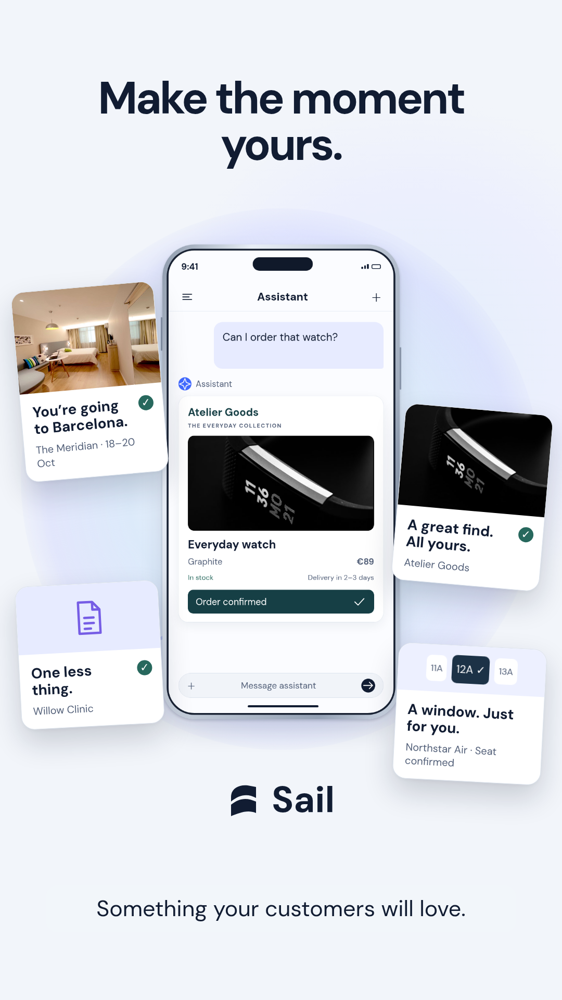

# A bigger closing payoff

Four completed customer experiences fan out from the same conversation. Photographic cards, a larger phone, softly connected paths and depth make the final frame more substantial. The cards settle, the headline reveals, and Sail resolves beneath the composition.

Closing line: **Make the moment yours.**

Timing: fan-out starts at 54.35 seconds, headline reveals at 54.95, Sail resolves at 55.4; completed frame holds through the end. Existing narration is retained. This is a screenshot preview, before the next reel render.

Checked the reveal and final state with HyperFrames: zero runtime, layout or contrast errors. Two overlap warnings concern transient card fan-out; final hero frame keeps assistant content readable.
