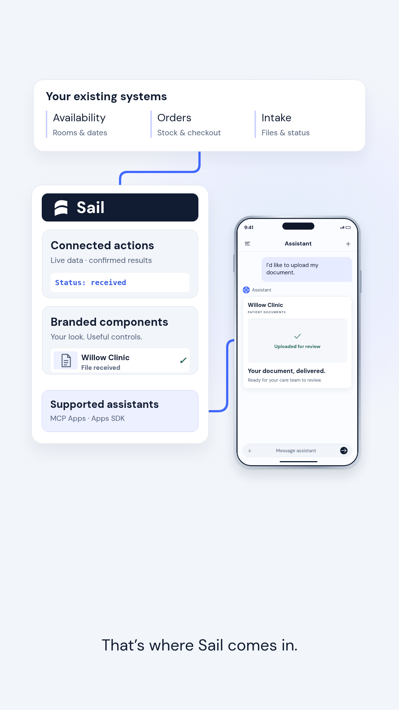

# Screen 5 — clearer flow layout

Business systems occupy one source row. Sail's connected actions, branded components and supported-host delivery are grouped in one enclosure. A larger persistent assistant sits beside it, with a short connector entering the actual widget. This keeps the engineering-reviewed separation of actions, presentation and supported-host integration while reducing the tall stack of disconnected boxes.

Preview screenshot only; narration and timing are retained. HyperFrames runtime, layout and contrast checks report zero errors. Transient overlap/contrast warnings concern moving tokens and the reveal, rather than the final pictured layout.
