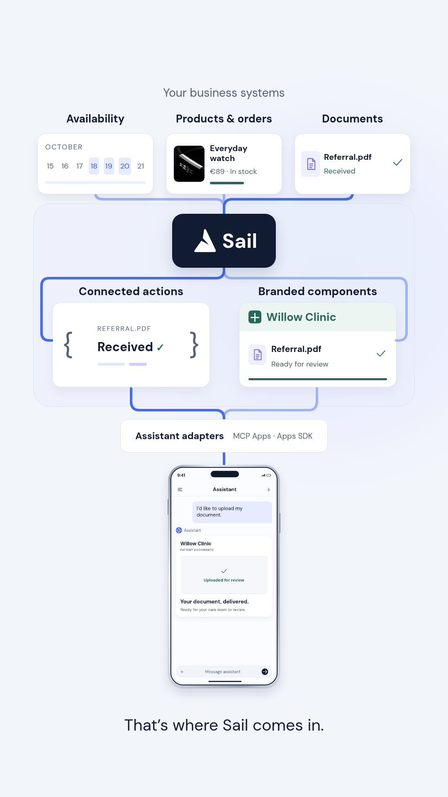

# Screen 5 — visual, balanced architecture

Business sources are illustrated as actual miniature interfaces: availability, a product/order and a received document. Sail is the central hub. Inside its region, business action results and branded presentation remain separate; they converge through an explicit assistant adapter before reaching the customer's existing assistant. The two visual lanes have matched scale and spacing rather than stacked explanatory paragraphs.

Data travels into Sail, the branded status binds to its business result, a UI signal reaches the host adapter, and a confirmed result returns. The document preview and phone show the same received-for-review state.

An engineering architect reviewed this new composition against the previously documented MCP Apps / Apps SDK contract and found no critical misrepresentation. This is a proposed integration architecture, not a statement that production integrations are implemented.

Preview still only, before the next full reel render.
