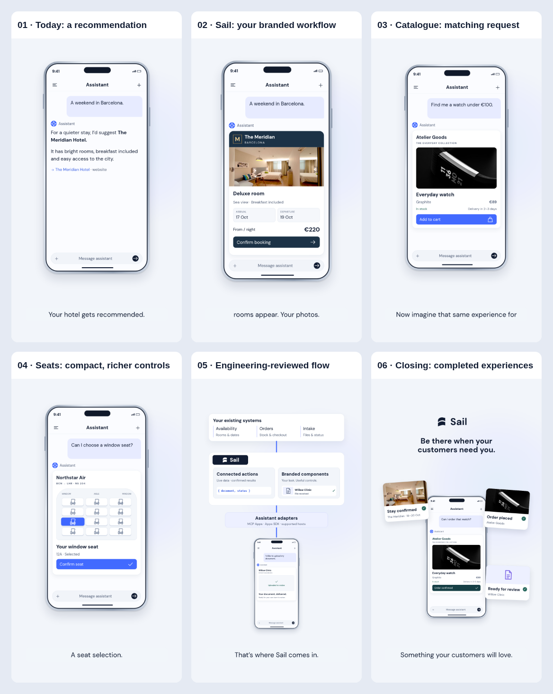

# Sail reel — screenshot revision for review

Preview stills only, before the next video render. Approved narration and timing are retained.

| Frame | Change |
| --- | --- |
| [Current recommendation](01-current-recommendation.png) | Ordinary assistant prose with a source link, rather than a branded booking card. Representative current interaction pattern, not a pixel-exact capture of a specific host. |
| [Branded booking](02-branded-booking.png) | A real room photograph, business identity and actionable dates/prices make the new experience visibly different. |
| [Catalogue](03-catalogue.png) | Matching product request, photographic product, stock/delivery details and a shorter card. |
| [Seat selection](04-seat-selection.png) | Matching request, cabin framing, tactile controls and selected-seat feedback. |
| [Document intake](05-document-intake.png) | Matching request, named file, upload progress and a compact completion state. |
| [Architecture](06-architecture.png) | Systems → connected actions + branded components → supported-host adapters → the persistent assistant. Reviewed by an engineering architect against official MCP Apps and Apps SDK documents. |
| [Closing payoff](07-closing-payoff.png) | Completed stay, order and intake experiences assemble around the same conversation, with a broader Sail closing line. |

[Engineering review and first-party evidence](ARCHITECTURE-REVIEW.md). This validates a proposed architecture, not production Sail integrations.

[Photographic source records](ASSET-SOURCES.md). Real photos are illustrative. No generated imagery.

Verification: HyperFrames check passes; zero runtime, layout or contrast errors. Two duplicate-source media warnings reflect intentional reuse of photos across card states and closing previews.
